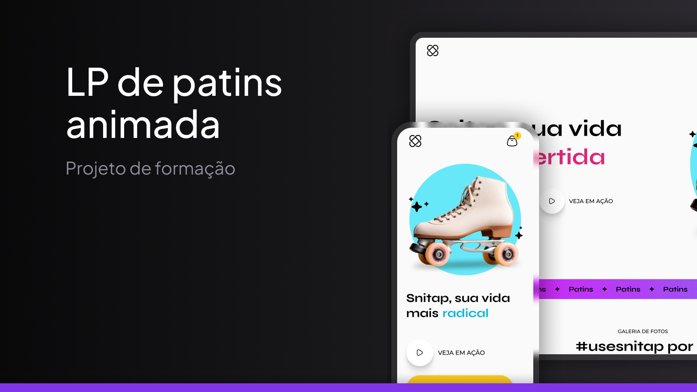

<h1 align="center"> Snitap Landing Page </h1>

Uma Landing Page de venda de patins fictícia feita como forma de estudos do curso Fullstack da Rocketseat

<a href="https://guilhermedkdk.github.io/LP-snitap/">🔗 Live Preview</a>&nbsp;&nbsp;&nbsp;|&nbsp;&nbsp;&nbsp;
<a href="#-tecnologias">🚀 Tecnologias</a>&nbsp;&nbsp;&nbsp; |&nbsp;&nbsp;&nbsp;&nbsp;
<a href="#-projeto">💻 Projeto</a>&nbsp;&nbsp;&nbsp;|&nbsp;&nbsp;&nbsp;
<a href="#-aprendizados">📚 Aprendizados</a>

## 🚀 Tecnologias

Esse projeto foi desenvolvido com as seguintes tecnologias:

- HTML e CSS
- Git e Github
- FIGMA

## 💻 Projeto e Desafio

A Snitap Landing Page foi um mini projeto do curso Fullstack da Rocketseat no módulo "Avançando HTML e CSS", onde apliquei animações, transições e como desafio tornei ela responsiva para mobile, criando uma landing page dinâmica e adaptável.

## 📚 Aprendizados

Este projeto foi feito dentro do curso de Fullstack no módulo "Avançando HTML e CSS" da Rocketseat.
Nele pude consolidar os conhecimentos sobre:

### CSS
- Animações
- Transições
- Funções
- Responsividade
